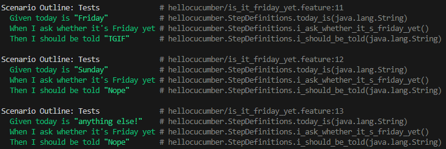

= R5.A.08 -- Dépôt pour les TPs
:icons: font
:MoSCoW: https://fr.wikipedia.org/wiki/M%C3%A9thode_MoSCoW[MoSCoW]

Ce dépôt concerne les rendus de mailto:wa-iL.gana@etu.univ-tlse2.fr[Wa-îl Gana].

== TP1

.Code de la page is_it_friday_yet.feature
[source,java]
---
Feature: Is it Friday yet?
  Everybody wants to know when it's Friday

    Scenario Outline: Tests
        Given today is "<day>"
        When I ask whether it's Friday yet
        Then I should be told "<answer>"

        Examples:
            | day | answer |
            | Friday  | TGIF  | 
            | Sunday  | Nope  |
            | anything else!  | Nope  |
---

.Caprute d’écran de l’exécution avec succès des tests



== TP2

.Code de la page de order.java

```
package dojo;

import java.util.ArrayList;
import java.util.List;

class Order {
    String owner;
List<String> cocktails =new ArrayList<>();
    String target;

    public void declareOwner(String owner) {
        this.owner = owner;

    }

    public void declareTarget(String target) {
        
        this.target = target;
    
    }

    public List<String> getCocktails() {
        
        return cocktails;
    
    }
}
```

.Caprute d’écran de l’exécution avec succès des tests


== TP3

.Code de la page de compteur.feature

---
Feature: Click Counter Application

  Scenario: User clicks the "Click me!" button once
    Given I have opened the Click Counter application
    When I click the "Click me!" button
    Then the click count should be 1
    And the double click count should be 0

  Scenario: User clicks the "Click me!" button multiple times
    Given I have opened the Click Counter application
    When I click the "Click me!" button 3 times
    Then the click count should be 3
    And the double click count should be 0

  Scenario: User clicks the "Double Click here!" button once
    Given I have opened the Click Counter application
    When I click the "Double Click here!" button
    Then the click count should be 2
    And the double click count should be 1

  Scenario: User clicks both buttons once
    Given I have opened the Click Counter application
    When I click the "Click me!" button
    And I click the "Double Click here!" button
    Then the click count should be 3
    And the double click count should be 1

  Scenario: User clicks the "Double Click here!" button twice
    Given I have opened the Click Counter application
    When I click the "Double Click here!" button twice
    Then the click count should be 4
    And the double click count should be 
---

.Code de la page de Test compteur_click.py
```
from behave import given, when, then
import tkinter as tk
from maincompteur import ClickCounterApp

@given('I have opened the Click Counter application')
def step_given_open_application(context):
    context.root = tk.Tk()
    context.app = ClickCounterApp(context.root)

@when('I click the "Click me!" button')
def step_when_click_button(context):
    context.app.increment_count()

@when('I click the "Click me!" button {times:d} times')
def step_when_click_button_multiple_times(context, times):
    for _ in range(times):
        context.app.increment_count()

@when('I click the "Double Click here!" button')
def step_when_double_click_button(context):
    context.app.add_double_clicks()

@when('I click the "Double Click here!" button twice')
def step_when_double_click_button_multiple_times(context):
    for _ in range(2):
        context.app.add_double_clicks()

@when('I click the "Click me!" button and I click the "Double Click here!" button')
def step_when_click_both_buttons(context):
    context.app.increment_count()
    context.app.add_double_clicks()

@then('the click count should be {expected_count:d}')
def step_then_check_click_count(context, expected_count):
    assert context.app.click_count == expected_count, f"Expected {expected_count}, but got {context.app.click_count}"

@then('the double click count should be {expected_count:d}')
def step_then_check_double_click_count(context, expected_count):
    assert context.app.double_click_count == expected_count, f"Expected {expected_count}, but got {context.app.double_click_count}"
```

==== Explication
1. Étape @Given
L’étape initialise les variables.

2. Étapes @When
Chaque étape simule une action utilisateur comme un clic simple ou un double clic en manipulant directement les variables.

3. Étapes @Then
Ces étapes vérifient si les compteurs correspondent aux valeurs attendues après les actions simulées.

==== Objectif 

L’objectif était de tester une application simple, créée lors de la première année, pour vérifier que toutes ses fonctionnalités fonctionnent correctement. Étant donné la simplicité de l’application (gestion de clics et double clics), il n’y avait pas un grand nombre de tests nécessaires. L’idée était d’appliquer des tests basiques pour garantir que la logique derrière les compteurs fonctionne comme prévu.


.Caprute d’écran de l’exécution avec succès des tests

image::TP3.png[width=80%]
